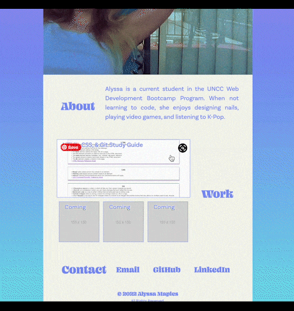

# Horiseon Landing Page

## Description

The goal of this project was to build a portfolio that would be responsive based on the size of the user's viewport. 

## Table of Contents

- [Installation](#installation)
- [Application Preview](#application-preview)
    - [RWD Examples](#rwd-examples)
    - [Misc Features](#misc-features)
- [Languages Used](#languages-used)
- [Important Links](#important-links)
- [Credits](#credits)
- [License](#license)
    - [MIT License](#mit-license)

## Installation

- Navigate to the 'clone' button on the github repository and use either SSH or HTTPS link to clone the repository to your computer.

- On your computer, navigate to the 'portfolio' directory. 

- Open the 'index.html' file in your browser.

## Application Preview

### RWD Examples

See below for examples of how the page was designed to be responsive.

The width of the body (and its content) will adjust based on the viewport:

If the viewport width is under 600px, it will display the content in a column:

Here is what the page will look like on an iPad Air and devices with a similar viewport size:

Here is what the page will look like on an iPhone SE and devices with a similar viewport size:

### Misc Features

Hovering over links in the navigation and contact section will change its' background and font color:

When you click on a link in the navigation, it will bring you to that part of the page:

Clicking on the images in the work section will bring the user to the deployed application.

## Languages Used

- HTML
- CSS

## Important Links

- [Github Repository](https://github.com/armaples/portfolio)
- [Deployed Application](https://armaples.github.io/portfolio/)

## Credits
- [Professional README Guide](https://coding-boot-camp.github.io/full-stack/github/professional-readme-guide) 
- [Writing a README](https://www.learnhowtoprogram.com/introduction-to-programming/git-html-and-css/writing-a-readme)
- [Choose A License](https://choosealicense.com/licenses/mit/)

## License

### MIT License

Copyright (c) 2019 Horiseon Social Solution Services, Inc.

Permission is hereby granted, free of charge, to any person obtaining a copy
of this software and associated documentation files (the "Software"), to deal
in the Software without restriction, including without limitation the rights
to use, copy, modify, merge, publish, distribute, sublicense, and/or sell
copies of the Software, and to permit persons to whom the Software is
furnished to do so, subject to the following conditions:

The above copyright notice and this permission notice shall be included in all
copies or substantial portions of the Software.

THE SOFTWARE IS PROVIDED "AS IS", WITHOUT WARRANTY OF ANY KIND, EXPRESS OR
IMPLIED, INCLUDING BUT NOT LIMITED TO THE WARRANTIES OF MERCHANTABILITY,
FITNESS FOR A PARTICULAR PURPOSE AND NONINFRINGEMENT. IN NO EVENT SHALL THE
AUTHORS OR COPYRIGHT HOLDERS BE LIABLE FOR ANY CLAIM, DAMAGES OR OTHER
LIABILITY, WHETHER IN AN ACTION OF CONTRACT, TORT OR OTHERWISE, ARISING FROM,
OUT OF OR IN CONNECTION WITH THE SOFTWARE OR THE USE OR OTHER DEALINGS IN THE
SOFTWARE.